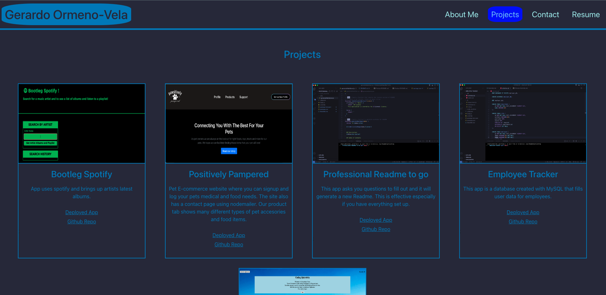

# Gerardos-Portfolio-React
  
  

  ## Description:
  My motivation for this project was to create a portfolio on react. I built this to test out the routing in react as well as the other features using previous knowledge from my original portfolio. This solves being able to route in React, design a webpage and bring in different information like pictures and text.  In the end I learned how to use React completely on the front end.

  ## Table of Contents 
  - [Installation](#installation)
  - [Usage](#usage)
  - [License](#license)
  - [Contribution](#contribution)
  - [Testing](#testing)
  - [Additional Info](#additional-info)
  ## Installation:
  -Download REACT -npm run build -npm start
  ## Usage:
  [Portfolio Website](https://gerardos-react-portfolio.netlify.app/)
  

  ## License
    This application is covered by the MIT license.

  ## Contribution:
  Using this repo to furhter your createive designs for a REACT Portfolio.
  ## Testing:
  Run the install instructions.
  ## Additional Info:
  - Github: [syntaxsemantixs](https://github.com/syntaxsemantixs)
  
  

